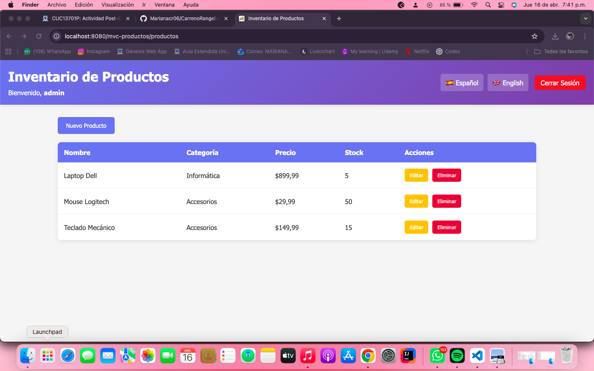
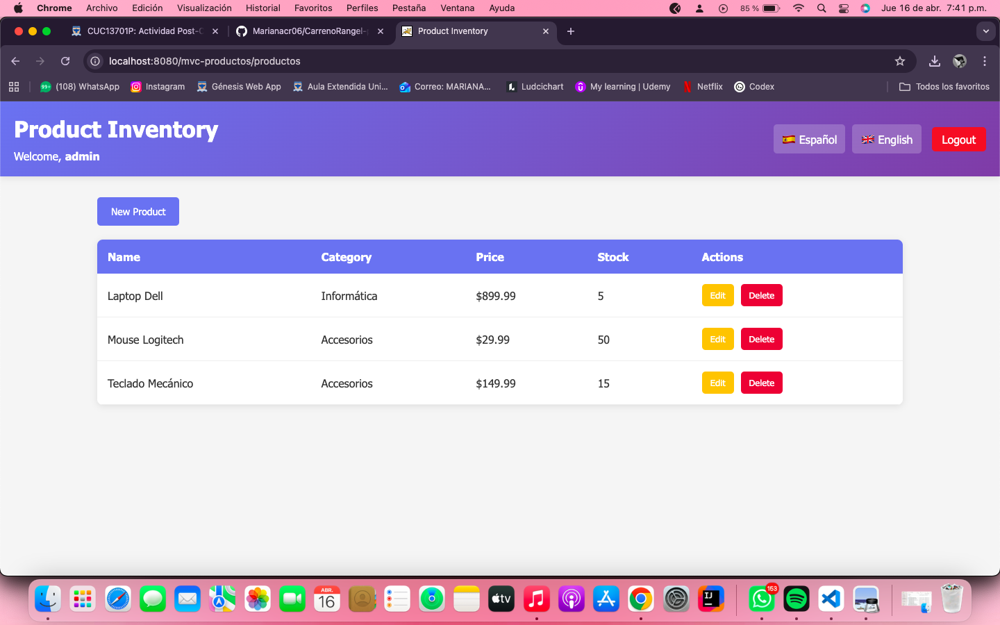
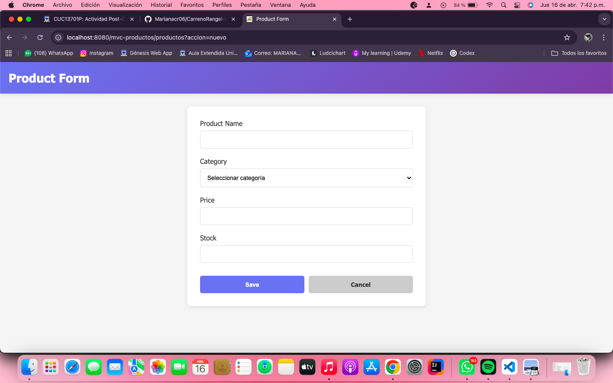
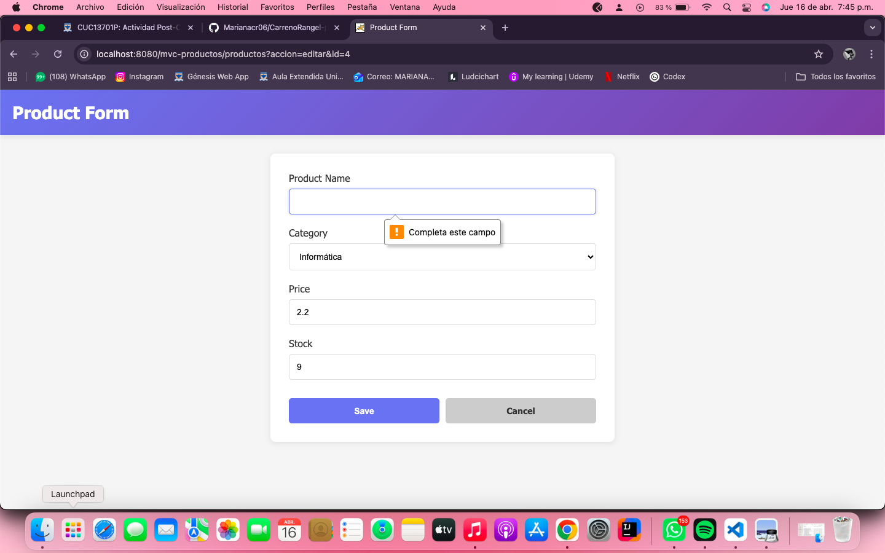
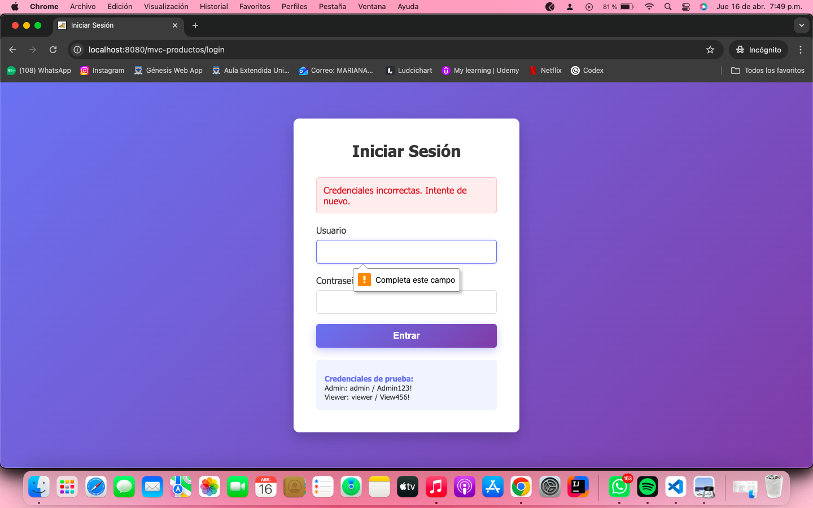

# CarrenoRangel-post2-u6

Proyecto de la actividad Post-Contenido 2 (Unidad 6) usando JSP + Servlets con patron MVC.

## Contenido del proyecto

- Codigo fuente: `mvc-productos/src/`
- Documentacion principal: `mvc-productos/README.md`
- Capturas de evidencia: `Img/`

## Funcionalidades implementadas

- Autenticacion con sesion (HttpSession)
- CRUD de productos
- Validaciones del lado del servidor
- Internacionalizacion (Espanol/English)
- Cierre de sesion con invalidacion de sesion

## Ejecucion rapida

```bash
cd mvc-productos
mvn clean package
```

Desplegar el WAR generado en `mvc-productos/target/mvc-productos.war` en Tomcat.

## Evidencias

### 1) Cambio de idioma a Espanol



### 2) Cambio de idioma a English



### 3) Persistencia de idioma al navegar al formulario



### 4) Validacion de Nombre vacio



### 5) Acceso sin credenciales redirige a login


